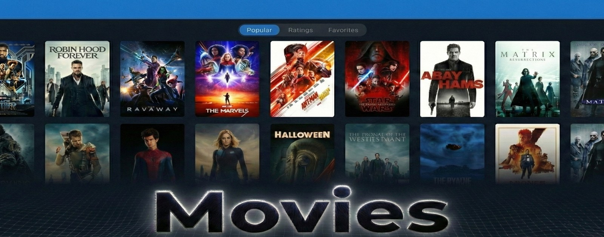

<div align="center">



[](https://reactnative.dev/)
[](https://expo.dev/)
[](https://www.typescriptlang.org/)
[](https://www.sqlite.org/index.html)
[](https://github.com/pmndrs/zustand)

A cross-platform mobile app for discovering movies, powered by the TMDb API.

[Try It](https://movies.hatstack.fun)

---

</div>

## Features

- Browse popular movies and top-rated TV shows
- Filter by popular, top-rated, or favorites
- Mark movies as favorites for quick access
- Watch YouTube trailers and read user reviews
- Offline mode with cached movie data

## Technologies Used

- React Native
- Expo
- TypeScript
- Zustand (State Management)
- Expo SQLite (Local Database)
- React Native Paper (Material Design 3)
- Expo Router (Navigation)
- TMDb API
- YouTube API
- Jest & React Native Testing Library

## Building

1.  **Prerequisites:** Node.js (20+) and npm.
2.  **Clone:** `git clone https://github.com/HatmanStack/react-movies.git`
3.  **Navigate:** `cd react-movies`
4.  **Install:** `npm install`
5.  **API Keys:** Copy `.env.example` to `.env` and fill in your API keys:
    ```env
    EXPO_PUBLIC_TMDB_API_KEY=your_tmdb_api_key_here
    EXPO_PUBLIC_YOUTUBE_API_KEY=your_youtube_api_key_here
    ```
6.  **Run:** `npx expo start` and scan the QR code with the Expo Go app, or press `w` for web.

## License

This project is licensed under the Apache License 2.0. See [LICENSE](LICENSE) for details.
